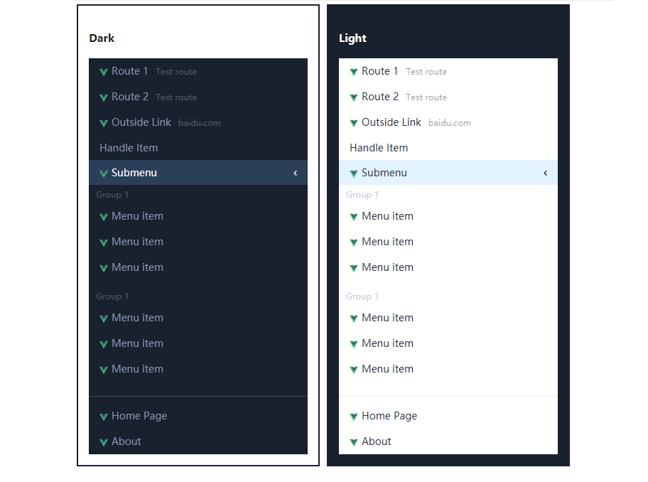

# Menu

A menu component for vue.

```js
import VcMenu from '@dove-ui/menu'
import '@dove-ui/menu/dist/index.css'

Vue.use(VcMenu) // VcMenu
```

```html
<vc-menu :menus="menus" theme="dark"></vc-menu>
```



### Menu Attributes

| Attribute      | Description        | Type                    | Accepted Values | Default |
|----------------|--------------------|-------------------------|-----------------|---------|
| menus          | Menus object       | [MenuItem[]](#MenuItem) | —               | —       |
| theme          | Menu theme         | string                  | `dark`/`light`  | —       |
| current-active | Selected items     | any[]                   | —               | []      |
| multiple       | Multiple selection | boolean                 | —               | false   |
| render-item    | Custom item render | function                | —               | —       |

### Menu Events

| Name     | Description        | Values                |
|----------|--------------------|-----------------------|
| selected | Selected item      | [MenuItem](#MenuItem) |
| open     | Open submenu item  | [MenuItem](#MenuItem) |
| close    | Close submenu item | [MenuItem](#MenuItem) |

### Menu Slot-scopes

| Name | Description        | Values                |
|------|--------------------|-----------------------|
| item | Custom item render | [MenuItem](#MenuItem) |

**Custom item render**

```html
 <vc-menu :menus="menus" :current-active="['item4']" theme="dark">
  <!-- before vue 2.6.0
  <template slot-scope="menu" slot="item">
    
    <span>{{menu.label}}</span>
  </template> -->

  <!-- vue 2.6.0+ -->
  <template v-slot:item="menu">
    
    <span>{{menu.label}}</span>
    <span style="font-size: 12px;margin-left:10px;opacity:0.5;">{{menu.description}}</span>
  </template>
</vc-menu>
```

### MenuItem

| Type            | Attribute        | Description                |
|-----------------|------------------|----------------------------|
| string/function | menus[].label    | item label                 |
| MenuItem[]      | menus[].children | submen                     |
| boolean         | menus[].group    | item is group              |
| boolean         | menus[].open     | open submenu               |
| string          | menus[].name     | unique item name           |
| string/object   | menus[].router   | router-link#to             |
| function        | menus[].hanlde   | item click handle function |
| string          | menus[].link     | link url                   |
| string          | menus[].target   | link tergat                |
| string          | menus[].title    | title                      |
| string          | menus[].type     | `line` Divider line        |


